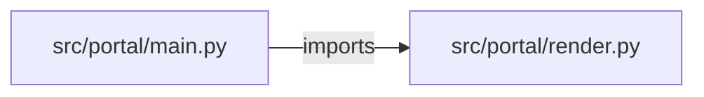

# kubernetes-deployment-portal — project architecture

[README](README.md) · [Interview questions and answers](INTERVIEW_QA.md)

## Purpose and scope

The form asks for a name, a pinned image, replicas, a resource profile, and a port. The API returns a Deployment, a Service, and a PodDisruptionBudget when there are two or more replicas, plus matching Helm values. `applied` is false: this portal does not call the cluster.

This document describes files and symbols in this checkout. Deployment templates and statements in the original overview are distinguished from a verified running environment.

## Component diagram



For Python repositories, arrows show resolved local imports, not network calls or deployment order. Otherwise the diagram is a repository component map; containment arrows do not assert runtime integration.

## Components and responsibilities

| Component | Responsibility |
| --- | --- |
| [`src/portal/main.py`](src/portal/main.py) | HTTP handlers: `GET /healthz`, `GET /profiles`, `POST /releases` |
| [`src/portal/render.py`](src/portal/render.py) | Functions: `validate`, `objects`, `render`, `helm_values` |
| [`requirements.txt`](requirements.txt) | Implementation or supporting configuration |
| [`web/src/App.tsx`](web/src/App.tsx) | User interface code/assets |
| [`Dockerfile`](Dockerfile) | Container build/service configuration |
| [`docker-compose.yml`](docker-compose.yml) | Container build/service configuration |
| [`tests/test_portal.py`](tests/test_portal.py) | Executable checks and regression examples |
| [`.github/workflows/ci.yml`](.github/workflows/ci.yml) | GitHub Actions job definitions |
| [`README.md`](README.md) | Project explanations or operating notes |

## Request interface

| Method and path | Handler | Source |
| --- | --- | --- |
| `GET /healthz` | `healthz` | [`src/portal/main.py`](src/portal/main.py#L20) |
| `GET /profiles` | `profiles` | [`src/portal/main.py`](src/portal/main.py#L25) |
| `POST /releases` | `create_release` | [`src/portal/main.py`](src/portal/main.py#L30) |

The table lists literal route decorators found in the inspected Python modules. Router prefixes and middleware can add behavior; check the linked handler and application setup before calling an endpoint.

## Implementation walkthrough

### `objects(release)`

Source: [`src/portal/render.py`](src/portal/render.py#L39).

Calls visible in this function: `found.append`, `release['env'].items`, `sorted`, `str`, `validate`.

```python
def objects(release):
    validate(release)
    name = release["name"]
    labels = {"app.kubernetes.io/name": name, "app.kubernetes.io/managed-by": "deployment-portal"}
    container = {
        "name": name,
        "image": release["image"],
        "ports": [{"containerPort": release["port"], "name": "http"}],
        "resources": PROFILES[release["profile"]],
        "readinessProbe": {"httpGet": {"path": release["health_path"], "port": "http"}, "periodSeconds": 10},
        "livenessProbe": {"httpGet": {"path": release["health_path"], "port": "http"}, "initialDelaySeconds": 15},
        "securityContext": {"runAsNonRoot": True, "allowPrivilegeEscalation": False, "readOnlyRootFilesystem": True},
    }
    if release["env"]:
        container["env"] = [{"name": key, "value": str(value)} for key, value in sorted(release["env"].items())]
    deployment = {
        "apiVersion": "apps/v1",
        "kind": "Deployment",
        "metadata": {"name": name, "labels": labels},
        "spec": {
            "replicas": release["replicas"],
            "selector": {"matchLabels": {"app.kubernetes.io/name": name}},
```

The excerpt is truncated; the linked source contains the full implementation.

### `validate(release)`

Source: [`src/portal/render.py`](src/portal/render.py#L20).

Calls visible in this function: `ENV_KEY.fullmatch`, `IMAGE.fullmatch`, `NAME.fullmatch`, `RenderError`, `SECRET_KEYS.search`, `image.endswith`.

```python
def validate(release):
    if not NAME.fullmatch(release["name"]):
        raise RenderError("name must be a DNS label: lowercase letters, digits, dashes, up to 42 characters")
    image = release["image"]
    if not IMAGE.fullmatch(image) or image.endswith(":latest"):
        raise RenderError("image tag latest is refused; pin repository:tag")
    if not 1 <= release["replicas"] <= 5:
        raise RenderError("replicas must be from 1 to 5")
    if release["profile"] not in PROFILES:
        raise RenderError("profile must be small, medium, or large")
    if not 1 <= release["port"] <= 65535:
        raise RenderError("port must be from 1 to 65535")
    for key in release["env"]:
        if not ENV_KEY.fullmatch(key):
            raise RenderError(f"env key {key} must be upper case letters, digits, underscores")
        if SECRET_KEYS.search(key):
            raise RenderError(f"env key {key} looks like a secret; mount a Secret instead of a literal value")
```

### `render(name, image, replicas, profile='small', port=8080, health_path='/healthz', env=None)`

Source: [`src/portal/render.py`](src/portal/render.py#L83).

Calls visible in this function: `objects`, `yaml.safe_dump_all`.

```python
def render(name, image, replicas, profile="small", port=8080, health_path="/healthz", env=None):
    release = {
        "name": name,
        "image": image,
        "replicas": replicas,
        "profile": profile,
        "port": port,
        "health_path": health_path,
        "env": env or {},
    }
    return yaml.safe_dump_all(objects(release), sort_keys=False)
```

### `helm_values(name, image, replicas, profile='small')`

Source: [`src/portal/render.py`](src/portal/render.py#L96).

Calls visible in this function: `image.rsplit`, `yaml.safe_dump`.

```python
def helm_values(name, image, replicas, profile="small"):
    repository, tag = image.rsplit(":", 1)
    return yaml.safe_dump(
        {"nameOverride": name, "image": {"repository": repository, "tag": tag}, "replicas": replicas, "resources": PROFILES[profile]},
        sort_keys=False,
    )
```

## Validation and failure paths

| Explicit exception | Source |
| --- | --- |
| `HTTPException(status_code=422, detail=str(exc))` | [`src/portal/main.py`](src/portal/main.py#L34) |
| `RenderError('name must be a DNS label: lowercase letters, digits, dashes, up to 42 characters')` | [`src/portal/render.py`](src/portal/render.py#L22) |
| `RenderError('image tag latest is refused; pin repository:tag')` | [`src/portal/render.py`](src/portal/render.py#L25) |
| `RenderError('replicas must be from 1 to 5')` | [`src/portal/render.py`](src/portal/render.py#L27) |
| `RenderError('profile must be small, medium, or large')` | [`src/portal/render.py`](src/portal/render.py#L29) |
| `RenderError('port must be from 1 to 65535')` | [`src/portal/render.py`](src/portal/render.py#L31) |
| `RenderError(f'env key {key} must be upper case letters, digits, underscores')` | [`src/portal/render.py`](src/portal/render.py#L34) |
| `RenderError(f'env key {key} looks like a secret; mount a Secret instead of a literal value')` | [`src/portal/render.py`](src/portal/render.py#L36) |

These are explicit exceptions in the inspected source, rather than a claim that every failure is handled. Follow the calling handler to see whether the exception becomes an HTTP response or propagates.

## Data and state

- [`src/portal/render.py`](src/portal/render.py) defines module-level containers: `PROFILES`.

Module-level dictionaries/lists live in a Python process. They can be fixtures or mutable state; inspect writes before treating them as persistent storage. A production extension would need to define persistence and concurrency behavior explicitly.

## Data flow and design decisions

### What is the input-to-output contract of `objects`

In [`src/portal/render.py`](src/portal/render.py#L39), `objects(release)` receives the inputs. The function computes these intermediate values:

- `name = release['name']`
- `labels = {'app.kubernetes.io/name': name, 'app.kubernetes.io/managed-by': 'deployment-portal'}`
- `container = {'name': name, 'image': release['image'], 'ports': [{'containerPort': release['port'], 'name': 'http'}], 'resources': PROFILES[release['profile']], 'readinessProbe': {'httpGet': {'path': release['health_path'], 'port': 'http'}, 'periodSeconds': 10}, 'livenessProbe': {'httpGet': {'path': release['health_path'], 'port': 'http'}, 'initialDelaySeconds': 15}, 'securityContext': {'runAsNonRoot': True, 'allowPrivilegeEscalation': False, 'rea`
- `deployment = {'apiVersion': 'apps/v1', 'kind': 'Deployment', 'metadata': {'name': name, 'labels': labels}, 'spec': {'replicas': release['replicas'], 'selector': {'matchLabels': {'app.kubernetes.io/name': name}}, 'template': {'metadata': {'labels': labels}, 'spec': {'containers': [container]}}}}`
- `service = {'apiVersion': 'v1', 'kind': 'Service', 'metadata': {'name': name, 'labels': labels}, 'spec': {'selector': {'app.kubernetes.io/name': name}, 'ports': [{'port': 80, 'targetPort': 'http'}]}}`
- `found = [deployment, service]`

Its result is defined by:

- `found`

### Which decision rules or boundary conditions should an interviewer challenge

The implementation in [`src/portal/render.py`](src/portal/render.py#L39) branches on:

- `release['env']`
- `release['replicas'] >= 2`

A useful extension is a table-driven test that covers each condition just below, at, and above its boundary where applicable. These expressions are the current rules; changing them changes behavior and should be justified by the project’s acceptance criteria.

### What does `web/src/App.tsx` own

[`web/src/App.tsx`](web/src/App.tsx) defines `App`, `submit`. Its imports include `react`.

Trace these definitions and imports to explain the module boundary. Relative imports identify project code; package imports should be checked against the nearest manifest.

## Setup and verification

The following commands are derived from the checked-in dependency/test contracts. Execute them from the repository root; the block prepares a local environment, not a cloud deployment.

```bash
python3 -m venv .venv
source .venv/bin/activate
python -m pip install -r requirements.txt
python -m pytest -q
```

Python dependencies: [`requirements.txt`](requirements.txt).

Test entry points: [`tests/test_portal.py`](tests/test_portal.py).

Automation definitions: [`.github/workflows/ci.yml`](.github/workflows/ci.yml). Read their triggers and job steps to determine what CI actually runs.

## Operating boundaries and design review

Before turning this checkout into a customer deployment, establish the input contract, data ownership, access controls, failure response, evaluation criteria, and rollback owner. Repository fixtures and unit tests demonstrate local behavior; they do not establish throughput, uptime, compliance, or business impact.

A useful architecture review starts with the linked implementation: identify where input enters, where a decision is made, which state can change, and which external dependency can fail. Add a deployment view only for infrastructure that is actually configured and exercised.
